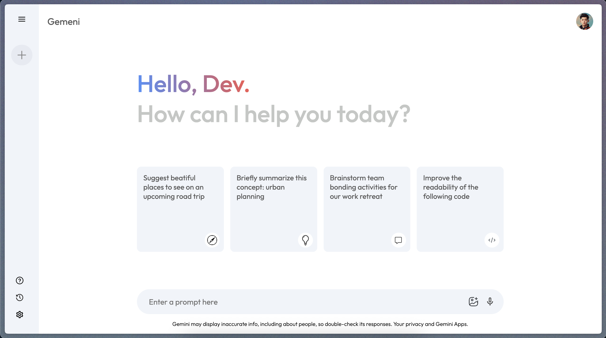

# Gemini Clone | Developed by Ahmad Sharkawi

A professional, modern web application that replicates the core experience of Google Gemini, built with React and Vite. This project leverages Google's Generative AI (Gemini) to provide users with an interactive chat interface for generating creative, informative, and helpful responses to a wide variety of prompts.

## Features

- **Conversational AI**: Chat with a generative AI powered by Google's Gemini API.
- **Prompt Suggestions**: Quick-access cards for common or creative prompt ideas.
- **Chat History**: View and revisit previous prompts and responses.
- **Voice & Image Input (UI)**: UI elements for microphone and gallery input (future extensibility).
- **Responsive Design**: Clean, modern interface that works across devices.
- **Activity & Settings**: Sidebar navigation for recent activity, help, and settings.

## Screenshots



## Getting Started

### Prerequisites
- [Node.js](https://nodejs.org/) (v16 or higher recommended)
- [npm](https://www.npmjs.com/) or [yarn](https://yarnpkg.com/)
- A Google Gemini API key ([get one here](https://makersuite.google.com/app/apikey))

### Installation

1. **Clone the repository:**
   ```bash
   git clone https://github.com/ahmads29/gemini-clone-as.git
   cd gemini-clone
   ```
2. **Install dependencies:**
   ```bash
   npm install
   # or
   yarn install
   ```
3. **Configure your API key:**
   - Open `src/config/gemini.js` and replace the `API_KEY` value with your own Google Gemini API key.

### Running the App

```bash
npm run dev
# or
yarn dev
```

The app will be available at [http://localhost:5173](http://localhost:5173) by default.

## Usage
- Enter a prompt in the chat box and press the send icon to interact with Gemini.
- Click on suggested prompt cards for inspiration.
- Use the sidebar to start a new chat, view recent activity, or access help/settings.

## Tech Stack
- **Frontend:** React 19, Vite
- **AI Integration:** @google/genai, @google/generative-ai
- **Styling:** CSS Modules
- **State Management:** React Context API

## Project Structure
```
gemeni-clone/
  ├── public/
  ├── src/
  │   ├── assets/         # Icons and images
  │   ├── components/     # Main UI components (Sidebar, Main)
  │   ├── config/         # Gemini API integration
  │   ├── context/        # React Context for state management
  │   ├── App.jsx         # Root component
  │   └── main.jsx        # Entry point
  ├── package.json
  └── README.md
```

## Contributing
Pull requests are welcome! For major changes, please open an issue first to discuss what you would like to change.


## Disclaimer
This project is for educational and demonstration purposes only. It is not affiliated with or endorsed by Google. Use your own API key and be mindful of usage limits and privacy when interacting with generative AI services.
